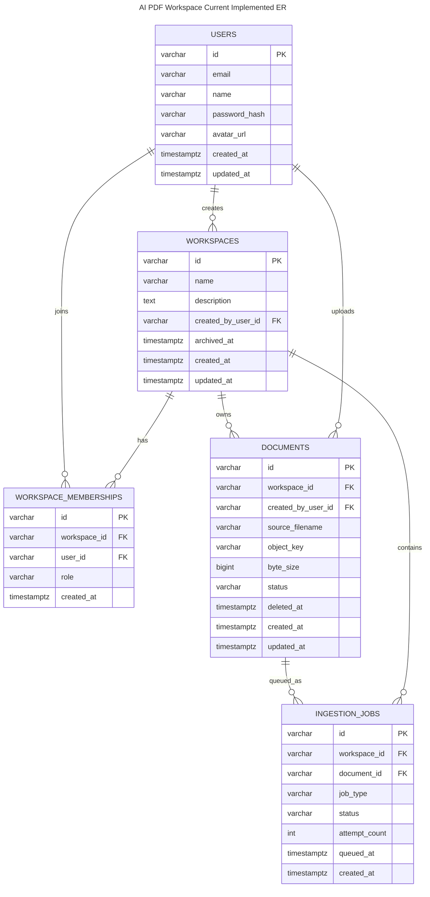
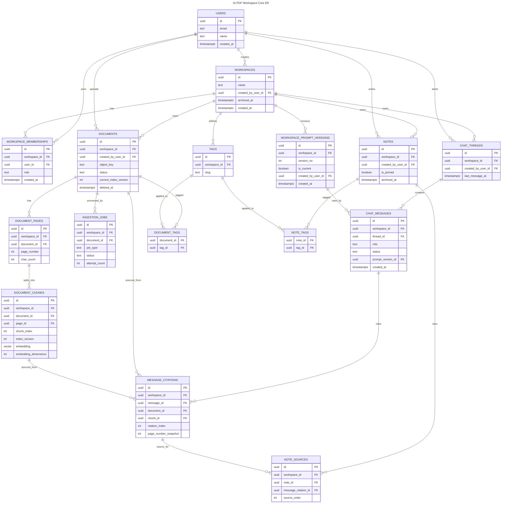

# 数据库设计

## 1. 文档定位

这份文档回答三件事：

1. 为什么数据库要这样设计
2. 每张表负责什么
3. 表和表之间如何关联

当前数据库设计覆盖 `文本 PDF 主链`，也承接 Worker 的 OCR fallback 结果：

- 文本层 PDF 直接提取文本
- 无文本层扫描 PDF 的 OCR 文本复用 `document_pages.extracted_text` 和 `document_chunks`
- 不做图表、表格、图片的多模态理解
- 不做 visual chunk 和 region-level citation

## 2. 设计结论

V1 采用 `Postgres + pgvector`，并把数据库分成 5 组表：

1. 鉴权与身份
2. Workspace 与配置
3. 文档与索引
4. 聊天与引用
5. 笔记与标签

设计原则是：

- `workspace_id` 是最重要的业务隔离键
- PDF 文件不存数据库，只在数据库里存元数据和对象存储路径
- 检索热路径尽量少 join
- 历史聊天和引用必须可回放，不能因为重建索引就失真
- V1 优先明确约束和可维护性，不做过度抽象

## 3. 为什么这样设计

### 3.1 为什么用 Postgres 而不是“数据库 + 独立向量库”

因为当前系统里，向量和业务数据是强耦合的。

一个 chunk 不只是一个向量，它还绑定：

- 属于哪个 Workspace
- 属于哪个文档
- 来自哪一页
- 是第几个 chunk
- 是哪次索引版本生成的
- 被哪些 citation 引用过

在这种场景下，V1 用 `Postgres + pgvector` 更合理：

- 事务简单
- 查询链短
- 文档、聊天、引用、索引状态可以放在一套数据库里统一维护
- 本地部署简单，面试和学习也更容易解释

### 3.2 为什么所有核心表都要带 `workspace_id`

因为产品的顶层边界不是“文档”，而是 `Workspace`。

数据库设计必须保证：

- 任意查询都能先按 `workspace_id` 收口
- 任意聊天、笔记、标签都不能串到别的 Workspace
- 后续做缓存、限流、对象存储路径时，也能统一用 `workspace_id`

所以除了纯全局身份表，其他业务核心表都必须显式保存 `workspace_id`。

### 3.3 为什么 `document_pages` 和 `document_chunks` 要拆开

因为页面和 chunk 是两种不同层级：

- `document_pages` 负责页面级信息
- `document_chunks` 负责检索级信息

这样设计的好处：

- Viewer 更容易按页取数据
- chunk 可以稳定挂到某一页上
- citation 可以先定位页，再定位 chunk
- 后续如果要调整 chunk 策略，不需要破坏页面层

### 3.4 为什么 embedding 直接放在 `document_chunks`

V1 里，一个 chunk 只保留一份“当前在线索引”用的 embedding。

这样做是为了：

- 检索热路径不多一次 join
- 文档索引逻辑简单
- 任务重建时替换当前在线 chunk 集合即可

不单独拆 `chunk_embeddings` 表，是一个刻意的 V1 简化。

### 3.5 为什么 `message_citations` 要单独建表

因为 citation 不是聊天文本的一部分，而是“回答引用了哪些文档片段”的结构化证据。

单独建表的好处：

- 回答展示时可以稳定渲染引用列表
- 后续点 citation 跳页更直接
- note 可以直接引用某条 citation
- 即使文档后续重建索引，历史回答仍可以靠快照字段保持可读

### 3.6 为什么 `notes` 和 `note_sources` 要拆开

因为：

- 笔记本身是用户写的内容
- 笔记来源是“这条笔记基于哪些引用或片段形成”

把来源单独建表，可以支持：

- 自由笔记没有来源
- 一条笔记引用多条 citation
- 后续扩展为“直接绑定某页/某 chunk”而不改 notes 主表

### 3.7 为什么标签关系不用一个泛型 `tag_bindings`

当前 V1 只需要给两类对象打标签：

- 文档
- 笔记

这里我选择：

- `document_tags`
- `note_tags`

而不是一个 `tag_bindings(target_type, target_id)`。

原因：

- 外键关系更强
- 查询更直接
- 不需要靠字符串类型做约束
- 数据完整性更好

这是用“更明确的表”换“少一点魔法”。

## 4. 数据库分组

### 4.1 鉴权与身份

- `users`
- `accounts`
- `sessions`
- `verification_tokens`

说明：

这一组建议直接交给 `Auth.js + Postgres Adapter` 管理。

数据库设计上不把产品业务字段塞进这些表。它们只负责：

- 用户是谁
- 如何登录
- Web 会话是什么

### 4.2 Workspace 与配置

- `workspaces`
- `workspace_memberships`
- `workspace_prompt_versions`

### 4.3 文档与索引

- `documents`
- `document_pages`
- `document_chunks`
- `ingestion_jobs`

### 4.4 聊天与引用

- `chat_threads`
- `chat_messages`
- `message_citations`

### 4.5 笔记与标签

- `notes`
- `note_sources`
- `tags`
- `document_tags`
- `note_tags`

## 5. 每张表负责什么

## 5.1 鉴权与身份

### `users`

负责什么：

- 系统里的用户主体

为什么要有：

- 任何 Workspace、文档、聊天、笔记都要能追溯“是谁创建/修改的”

建议核心字段：

- `id uuid pk`
- `email`
- `name`
- `avatar_url`
- `created_at`
- `updated_at`

### `accounts`

负责什么：

- 第三方登录账户映射，例如 GitHub / Google

为什么要有：

- Web 登录不应该自己重造 OAuth 数据结构

### `sessions`

负责什么：

- Web 会话

为什么要有：

- Next.js 会话鉴权要有持久化会话表

### `verification_tokens`

负责什么：

- 邮箱登录或验证码校验场景的短期令牌

为什么要有：

- 这是 Auth.js 数据模型的一部分，交给框架管理最稳

## 5.2 Workspace 与配置

### `workspaces`

负责什么：

- 表示一个独立知识空间

为什么要有：

- 它是系统最顶层的业务隔离单元

建议核心字段：

- `id uuid pk`
- `name`
- `description`
- `created_by_user_id`
- `archived_at nullable`
- `created_at`
- `updated_at`

关键约束：

- 不软删除优先，先支持归档

### `workspace_memberships`

负责什么：

- 用户与 Workspace 的成员关系

为什么要有：

- 鉴权判断的核心是“这个用户是不是这个 Workspace 的成员”

建议核心字段：

- `id uuid pk`
- `workspace_id`
- `user_id`
- `role`，至少 `owner/member`
- `created_at`

关键约束：

- `unique(workspace_id, user_id)`

### `workspace_prompt_versions`

负责什么：

- 保存某个 Workspace 的 Prompt 配置历史

为什么要有：

- Prompt 是业务配置，不该只存当前值
- 后续要支持回滚和版本对比

建议核心字段：

- `id uuid pk`
- `workspace_id`
- `version_no int`
- `system_prompt text`
- `answer_style jsonb nullable`
- `is_current boolean`
- `created_by_user_id`
- `created_at`

关键约束：

- `unique(workspace_id, version_no)`
- 每个 Workspace 只能有一个 `is_current = true`

## 5.3 文档与索引

### `documents`

负责什么：

- 一份 PDF 在系统里的主记录

为什么要有：

- 文件在 MinIO，但业务状态必须在数据库里
- 文档列表、文档状态、删除/重试都靠它

建议核心字段：

- `id uuid pk`
- `workspace_id`
- `created_by_user_id`
- `title`
- `source_filename`
- `object_key`
- `mime_type`
- `byte_size`
- `page_count nullable`
- `status`，例如 `pending_upload/uploaded/parsing/chunking/embedding/ready/failed/deleting/deleted`
- `current_index_version int default 1`
- `latest_ingestion_job_id nullable`
- `last_error_code nullable`
- `last_error_message nullable`
- `deleted_at nullable`
- `created_at`
- `updated_at`

为什么有 `current_index_version`：

- 文档重建索引后，当前在线 chunk 集合会切到新版本
- V1 不长期保留历史 chunk 集合在线，但需要知道当前是哪一版

### `document_pages`

负责什么：

- 存每一页的文本级结果和页级元数据

为什么要有：

- Viewer 需要页级信息
- chunk 必须挂到页上
- 后续页面内搜索也依赖这一层

建议核心字段：

- `id uuid pk`
- `workspace_id`
- `document_id`
- `page_number int`
- `extracted_text text`
- `char_count int`
- `created_at`

关键约束：

- `unique(document_id, page_number)`

### `document_chunks`

负责什么：

- 存真正用于检索的文本片段和向量

为什么要有：

- RAG 热路径直接查它
- 它是检索核心表

建议核心字段：

- `id uuid pk`
- `workspace_id`
- `document_id`
- `page_id`
- `chunk_index int`
- `chunk_text text`
- `token_count int`
- `char_start int nullable`
- `char_end int nullable`
- `index_version int`
- `embedding vector(1024)`
- `embedding_dimensions int`
- `embedding_provider`
- `embedding_model`
- `embedding_version`
- `created_at`

当前 `token_count` 是与模型无关的估算值：英文按词、中文按字符、标点按单元计数。真实 embedding provider 接入后，应按实际 tokenizer 重新计算并记录处理配置。

为什么这里同时保留 `vector(1024)` 和 `embedding_dimensions`：

- 当前本地 `qwen3-embedding:0.6b` 是 `1024` 维
- OpenAI 也可以在调用时收敛到 `1024` 维
- V1 的在线向量列仍统一为 `1024` 维，便于只维护一套 pgvector 索引
- 同时保留 `embedding_dimensions` 字段，是为了把“当时用的维度”作为元数据记录下来，避免后续 provider 或维度策略变化时丢失上下文

当前实现边界：本轮迁移先落页面和文本块字段，尚未创建 `embedding`、`embedding_dimensions`、`embedding_provider` 等向量字段；Worker 收口状态为 `chunked`。接入真实 embedding provider 时，再通过独立迁移补齐向量列和索引，文档状态才进入 `embedding -> ready`。

关键约束：

- `unique(document_id, page_id, chunk_index, index_version)`
- V1 一个 chunk 只属于一个 page，不做跨页 chunk

### `ingestion_jobs`

负责什么：

- 记录文档入库和重建索引等后台任务

为什么要有：

- Redis 队列不是最终真相源
- API 和前端要看持久化任务状态

建议核心字段：

- `id uuid pk`
- `workspace_id`
- `document_id`
- `job_type`，例如 `ingest/reindex/delete_cleanup`
- `status`，例如 `queued/running/succeeded/failed/cancelled`
- `attempt_count int`
- `config_snapshot jsonb`
- `error_code nullable`
- `error_message nullable`
- `requested_by_user_id`
- `queued_at`
- `started_at nullable`
- `finished_at nullable`
- `created_at`

为什么要有 `config_snapshot`：

- 索引策略、embedding provider、chunk 参数在任务执行时可能变化
- 任务要能回看“当时到底用什么配置跑的”

## 5.4 聊天与引用

### `chat_threads`

负责什么：

- 一组连续对话的容器

为什么要有：

- 聊天历史不是一堆散消息，需要能按 thread 回看和续聊

建议核心字段：

- `id uuid pk`
- `workspace_id`
- `created_by_user_id`
- `title nullable`
- `archived_at nullable`
- `last_message_at`
- `created_at`
- `updated_at`

### `chat_messages`

负责什么：

- thread 里的每条消息

为什么要有：

- 用户消息和助手消息都要单独持久化
- 后续引用、笔记来源、调试都依赖它

建议核心字段：

- `id uuid pk`
- `workspace_id`
- `thread_id`
- `role`，例如 `user/assistant`
- `content text`
- `status`，例如 `completed/failed`
- `model_provider nullable`
- `model_name nullable`
- `prompt_version_id nullable`
- `input_tokens nullable`
- `output_tokens nullable`
- `created_at`

为什么要存模型信息：

- 后续调试效果差异时要知道当时是哪套模型和 prompt 在工作

### `message_citations`

负责什么：

- 记录某条助手消息引用了哪些文档片段

为什么要有：

- 这是 citation 能稳定渲染、跳页、转 note 的基础

建议核心字段：

- `id uuid pk`
- `workspace_id`
- `message_id`
- `citation_index int`
- `document_id nullable`
- `chunk_id nullable`
- `page_number_snapshot int`
- `document_title_snapshot text`
- `excerpt_snapshot text`
- `index_version_snapshot int`
- `created_at`

为什么这里要有 snapshot 字段：

- 文档后续可能重建索引
- chunk 可能被替换
- 文档甚至可能被删除
- 但历史回答里的引用仍必须可读

所以 `message_citations` 既保存关联，也保存快照。

## 5.5 笔记与标签

### `notes`

负责什么：

- 用户沉淀下来的知识记录

为什么要有：

- 产品不是一次性聊天工具，笔记是长期资产

建议核心字段：

- `id uuid pk`
- `workspace_id`
- `created_by_user_id`
- `updated_by_user_id`
- `title nullable`
- `body_md`
- `is_pinned boolean default false`
- `archived_at nullable`
- `created_at`
- `updated_at`

### `note_sources`

负责什么：

- 记录一条 note 的来源证据

为什么要有：

- note 可以是自由写的，也可以基于一条或多条 citation 生成
- 来源不该塞回 notes 主表

建议核心字段：

- `id uuid pk`
- `workspace_id`
- `note_id`
- `source_order int`
- `message_citation_id nullable`
- `document_id nullable`
- `page_number_snapshot nullable`
- `excerpt_snapshot nullable`
- `created_at`

当前 V1 设计：

- 优先支持 `citation -> note`
- 自由笔记没有 source 记录

为什么这里允许快照字段：

- note 要长期可读
- 就算原 chunk 或原 message 结构变了，来源摘要也不该丢

### `tags`

负责什么：

- Workspace 内的标签定义

为什么要有：

- 标签是 Workspace 内的组织方式，不是全局系统标签

建议核心字段：

- `id uuid pk`
- `workspace_id`
- `name`
- `slug`
- `color nullable`
- `created_by_user_id`
- `created_at`

关键约束：

- `unique(workspace_id, slug)`

### `document_tags`

负责什么：

- 文档与标签的关系表

为什么要有：

- 一份文档可以有多个标签
- 一个标签也可以打到多份文档上

建议核心字段：

- `document_id`
- `tag_id`
- `created_at`

关键约束：

- `unique(document_id, tag_id)`

### `note_tags`

负责什么：

- 笔记与标签的关系表

为什么要有：

- 笔记同样是多对多打标签

建议核心字段：

- `note_id`
- `tag_id`
- `created_at`

关键约束：

- `unique(note_id, tag_id)`

## 6. 关键约束与索引策略

### 6.1 关键约束

1. 所有核心业务表必须带 `workspace_id`
2. `document_pages.page_number` 在同一文档内唯一
3. `document_chunks` 在同一 `document + page + chunk_index + index_version` 内唯一
4. `workspace_memberships` 在同一 `workspace + user` 内唯一
5. `workspace_prompt_versions` 在同一 Workspace 内只有一个当前版本
6. `message_citations` 必须有快照字段，不能只靠外键引用
7. `document_tags` 和 `note_tags` 都必须防重复绑定

### 6.2 建议索引

#### `workspace_memberships`

- `unique(workspace_id, user_id)`
- `index(user_id)`

#### `documents`

- `index(workspace_id, status, updated_at desc)`
- `index(workspace_id, deleted_at)`

#### `document_pages`

- `unique(document_id, page_number)`

#### `document_chunks`

- `index(workspace_id, document_id, page_id)`
- `index(document_id, index_version)`
- `pgvector index on embedding`

#### `ingestion_jobs`

- `index(document_id, created_at desc)`
- `index(workspace_id, status, created_at desc)`

#### `chat_threads`

- `index(workspace_id, last_message_at desc)`

#### `chat_messages`

- `index(thread_id, created_at)`
- `index(workspace_id, created_at desc)`

#### `message_citations`

- `index(message_id, citation_index)`

#### `tags`

- `unique(workspace_id, slug)`

## 7. 删除与历史保留策略

### `workspaces`

- 先归档，不做直接硬删除

### `documents`

- 先软删文档主记录
- 异步任务清理 MinIO 文件与 chunk/page 数据

### `chat_messages` / `message_citations`

- 默认保留
- 即使文档重建索引，citation 快照仍可读

### `notes`

- 支持归档，不建议直接硬删

为什么这样做：

- 知识工作流里“历史可回放”比“删得绝对干净”更重要
- 真正的大文件清理由异步任务做，不在同步请求里处理

## 8. 核心 ER 图

先放两张图，避免把“当前已落地”与“V1 目标全景”混在一起：

### 8.1 当前已落地最小 ER 图

这张图只反映当前代码和本地数据库里已经真正落地的真表链路：

- `users`
- `workspaces`
- `workspace_memberships`
- `documents`
- `ingestion_jobs`

对应文件：

- `docs/architecture/database-er-current.mmd`

### 8.2 V1 目标全景 ER 图

下面这张是 `产品核心 ER 图`。Auth.js 自带的 `accounts / sessions / verification_tokens` 属于框架表，不放进主图里。

对应文件：

- `docs/architecture/database-er.mmd`
- `docs/architecture/database-er.svg`

## 9. 当前数据库设计的边界

这份数据库设计是给当前 `文本 PDF V1` 用的。扫描 PDF 的 OCR 结果直接作为普通页面文本落在现有表中，不新增 OCR 专用数据表。

明确不包括：

- 独立的扫描件 OCR 结果表
- 图表 / 表格 / 图片区域表
- 多模态 chunk
- region-level citation
- 多 embedding profile 并行在线索引

如果后续要做这些，不应该在当前表上硬塞字段，而应该增加一层独立的页面理解与多模态索引设计。
